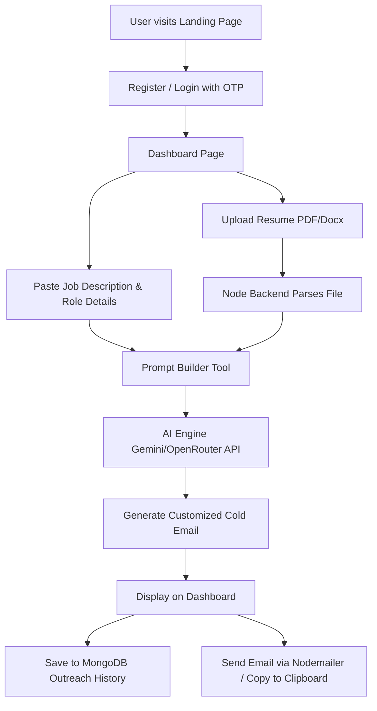

# ApplyPilot AI System Architecture Specification 🚀
**Author**: Staff AI Architect

This document details the production-ready AI pipeline and system architecture for **ApplyPilot**, optimized to maximize recruiter reply rates by shifting away from generic resume summaries to highly contextual, personalized, and human-like B2B cold emails.

---

## 1. Pipeline Architecture

The baseline pipeline of `Resume PDF -> Raw Text -> LLM -> Email` fails because LLMs default to summarization when presented with large, unstructured context. Our redesigned pipeline isolates concerns at each stage to ensure the final output is highly focused, concise, and persuasive.



### Pipeline Stage Details

| Stage | Input | Output | Purpose & Quality Impact |
| :--- | :--- | :--- | :--- |
| **1. Structured Parser** | Raw extracted PDF text | Structured Candidate JSON | Extracts skills, projects, achievements, and impact metrics. Strips formatting noise. |
| **2. Context Scraper** | Job Description (JD) text / Company URL | Structured Job & Company Profile | Scrapes company culture, tech stack, hiring priorities, and recent news. |
| **3. Project/Skill Ranker** | Candidate JSON + Job Profile | Top 2 Projects & Top 5 Skills | Algorithms select the most relevant elements to pitch, avoiding resume dumping. |
| **4. Email Planner** | Selected Projects + Company Motivators | Structured Generation Plan | Outlines the angle of personalization (e.g., why this project relates to their stack). |
| **5. AI Reviewer Loop** | Generated Draft | Quality Check Report (Pass/Fail) | Performs automated testing on word counts, AI clichés, tone, and project limits. |

---

## 2. Structured Resume Schema

We utilize **JSON Schema** with LLM Structured Outputs (e.g., OpenAI's `response_format` or Gemini's Schema enforcement) to extract structured candidate details.

```json
{
  "$schema": "http://json-schema.org/draft-07/schema#",
  "title": "CandidateProfile",
  "type": "object",
  "properties": {
    "personal": {
      "type": "object",
      "properties": {
        "name": { "type": "string" },
        "links": {
          "type": "array",
          "items": { "type": "string", "format": "uri" }
        }
      },
      "required": ["name", "links"]
    },
    "education": {
      "type": "array",
      "items": {
        "type": "object",
        "properties": {
          "institution": { "type": "string" },
          "degree": { "type": "string" },
          "year": { "type": "string" }
        },
        "required": ["institution", "degree"]
      }
    },
    "projects": {
      "type": "array",
      "items": {
        "type": "object",
        "properties": {
          "title": { "type": "string" },
          "impact_statement": { "type": "string" },
          "technologies": {
            "type": "array",
            "items": { "type": "string" }
          }
        },
        "required": ["title", "impact_statement", "technologies"]
      }
    },
    "skills": {
      "type": "array",
      "items": { "type": "string" }
    }
  },
  "required": ["personal", "education", "projects", "skills"]
}
```

---

## 3. Dynamic Selection Algorithms

### Project Selection Algorithm
To prevent hardcoded or generic project selection, we implement a hybrid semantic-and-keyword ranking algorithm:

1. **Embedding Generation**: Compute embedding vectors for the target Job Description ($V_{jd}$) and for each project's title, impact statement, and technologies combined ($V_{p_i}$) using `text-embedding-3-small`.
2. **Cosine Similarity**: Compute $Score_{semantic} = \cos(V_{jd}, V_{p_i})$ for each project.
3. **Keyword Boost**: Calculate a matching coefficient based on direct intersection of technologies:
   $$Score_{tech} = \frac{|Tech_{project} \cap Tech_{jd}|}{|Tech_{jd}|}$$
4. **Final Rank**: Compute the weighted score:
   $$Score_{final} = 0.7 \times Score_{semantic} + 0.3 \times Score_{tech}$$
5. **Selection**: Select the top 2 highest scoring projects.

### Skill Selection Algorithm
1. Filter the candidate's skills by direct match with the Job Description.
2. Group the remaining candidate skills into categories (Frontend, Backend, Infrastructure, AI).
3. Select up to 5 total skills, prioritizing skills explicitly marked as "required" in the JD, followed by those that are "preferred."

---

## 4. Scraper & Company Analysis Service

A worker scrapes company website domains, careers pages, and tech blog RSS feeds using a headless browser (Puppeteer) or a structured web scraping service like **Firecrawl**:

- **Tech Stack Extraction**: Inspects HTTP headers, Wappalyzer signatures, and job post requirements to determine their stack (e.g., Next.js, Go, AWS).
- **Culture & Values Mapping**: Parses the "About Us" and "Mission" text to extract core values (e.g., speed, security, data privacy).
- **Recent News (Optional)**: Performs a Google Search API query (via Tavily/Exa) for recent press releases (e.g., Series B funding, product launch) to inject authentic, non-hallucinated reasons for interest.

---

## 5. Production Prompt Engineering

### 1. System Prompt
```markdown
You are an elite B2B cold email copywriter specializing in developer outreach.
Your reader is a busy Engineering Manager or Recruiter.
Your objective is to write a highly compelling, personalized outreach email that makes the recruiter want to open the candidate's attached resume.

Strictly adhere to the following rules:
- Writing Perspective: ALWAYS write as the candidate. Never speak from the recruiter's perspective.
- Length Constraint: The email body must be between 120 and 160 words.
- Project Restraint: Mention EXACTLY two projects. Describe each project in exactly one sentence focusing on business or technical impact, not a list of tools.
- Skill Restraint: Mention only 4-5 relevant skills. Do not dump the resume's tech stack.
- Formatting: Use simple, plain paragraphs (max 2-3 sentences per paragraph). No markdown headers, no bullet points, no bold text.
- Anti-Clichés: Never use AI markers ("I hope you are doing well", "I am writing to express my interest", "I came across your profile"). Start directly and naturally.
```

### 2. User Prompt
```markdown
Job Description:
"""
{{JOB_DESCRIPTION}}
"""

Company Tech Stack & Mission:
"""
{{COMPANY_INFO}}
"""

Candidate Profile:
"""
{{CANDIDATE_PROFILE}}
"""

Generate the cold email. Output ONLY the final plain text email. Do not include markdown formatting or conversational preambles.
```

### 3. Reviewer Prompt
```markdown
Analyze the generated cold email against the candidate profile and job description.
Return a JSON object in this format:
{
  "isValid": true | false,
  "reasons": ["List of failed checks"],
  "metrics": {
    "wordCount": 145,
    "projectCount": 2,
    "skillCount": 4,
    "containsClichés": false,
    "summarizesResumeOnly": false
  }
}

Checks to run:
1. Is the word count strictly between 120 and 170 words?
2. Are there exactly two projects mentioned?
3. Does the email contain generic openings like "I hope this email finds you well"?
4. Does it sound like a resume summary instead of a targeted pitch?
```

### 4. Regeneration Prompt
```markdown
The previously generated email failed quality checks for the following reasons:
{{REVIEWER_FEEDBACK}}

Regenerate the cold email, correcting these issues while maintaining a natural, human-like voice.
```

---

## 6. Software Engineering & System Design

### Folder Structure
```text
applypilot/
├── prisma/
│   └── schema.prisma
├── src/
│   ├── app/
│   │   ├── api/
│   │   │   ├── upload/route.ts
│   │   │   ├── generate/route.ts
│   │   │   └── history/route.ts
│   │   └── dashboard/page.tsx
│   ├── components/
│   │   └── ui/                  # Shadcn components
│   ├── lib/
│   │   ├── db.ts                # Prisma client singleton
│   │   └── redis.ts             # Upstash Redis client
│   └── services/
│       ├── ai/
│       │   ├── parser.ts        # LLM structured parser
│       │   ├── reviewer.ts      # Self-correction loop
│       │   └── promptTemplates.ts
│       ├── scrapers/
│       │   └── companyScraper.ts
│       └── rankers/
│           ├── projectRanker.ts
│           └── skillRanker.ts
```

### Prisma Schema Design
```prisma
datasource db {
  provider = "postgresql"
  url      = env("DATABASE_URL")
}

generator client {
  provider = "prisma-client-js"
}

model User {
  id        String    @id @default(uuid())
  email     String    @unique
  resumes   Resume[]
  emails    Email[]
  createdAt DateTime  @default(now())
}

model Resume {
  id             String   @id @default(uuid())
  userId         String
  user           User     @relation(fields: [userId], references: [id], onDelete: Cascade)
  filePath       String
  parsedData     Json     // Structured JSON Schema
  rawText        String
  createdAt      DateTime @default(now())
}

model Email {
  id             String   @id @default(uuid())
  userId         String
  user           User     @relation(fields: [userId], references: [id], onDelete: Cascade)
  jobTitle       String
  companyName    String
  promptUsed     String
  emailSubject   String
  emailBody      String
  reviewerScore  Json
  createdAt      DateTime @default(now())
}
```

### Caching & Rate Limiting
- **Redis Caching**: Cached company scraping results (via domain key, e.g., `company:stripe.com`) with a Time-To-Live (TTL) of 7 days to prevent redundant scraping.
- **Rate Limiting**: Implemented a sliding window token-bucket rate limiter via `@upstash/ratelimit` on Next.js edge API routes.

---

## 7. Quality Assurance & Evaluation (LLM-as-a-Judge)

To ensure high-quality output at scale, we use a dual-metric evaluation strategy:

1. **Rule-Based Metrics**: Regex checking for word counts ($120 \le N \le 170$), lack of bullet points, presence of links (LinkedIn, GitHub), and check for banned words/phrases list.
2. **Semantic Judge Metrics**: We run a secondary prompt (LLM-as-a-Judge) grading the output on a scale of 1-5 for:
   - **Vague / Resume summary look**: Does it read like a cover letter?
   - **Persuasion Index**: Does it link candidate achievements directly to the company's value proposition?
   - **Tone Score**: Does the text resemble human-written text? (Checked using entropy/perplexity analysis metrics).
